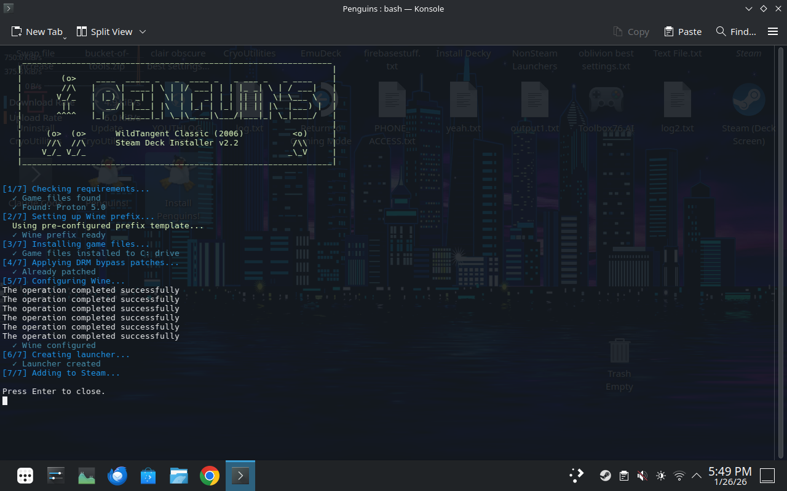
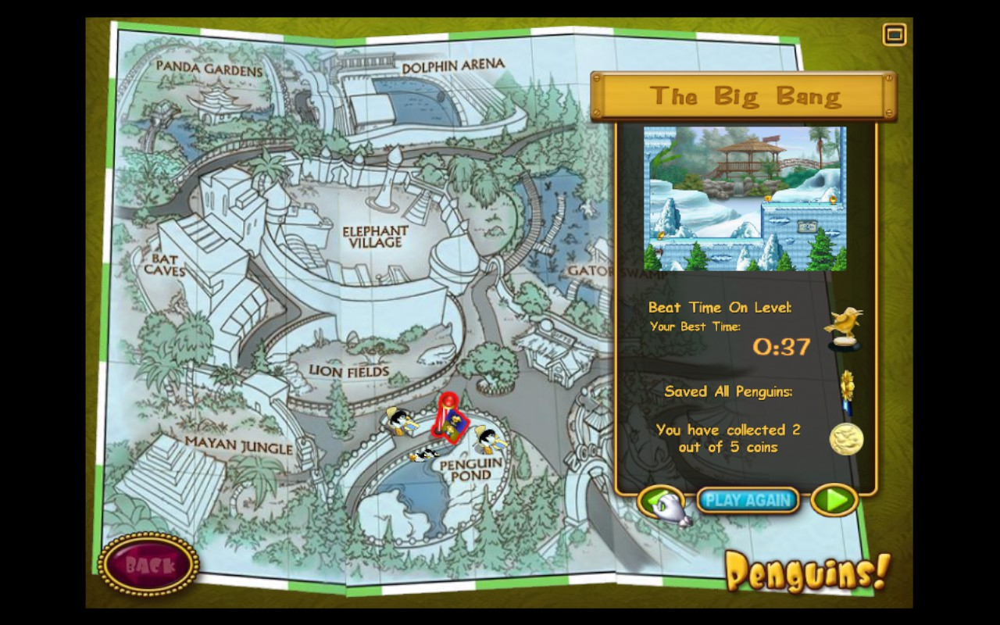
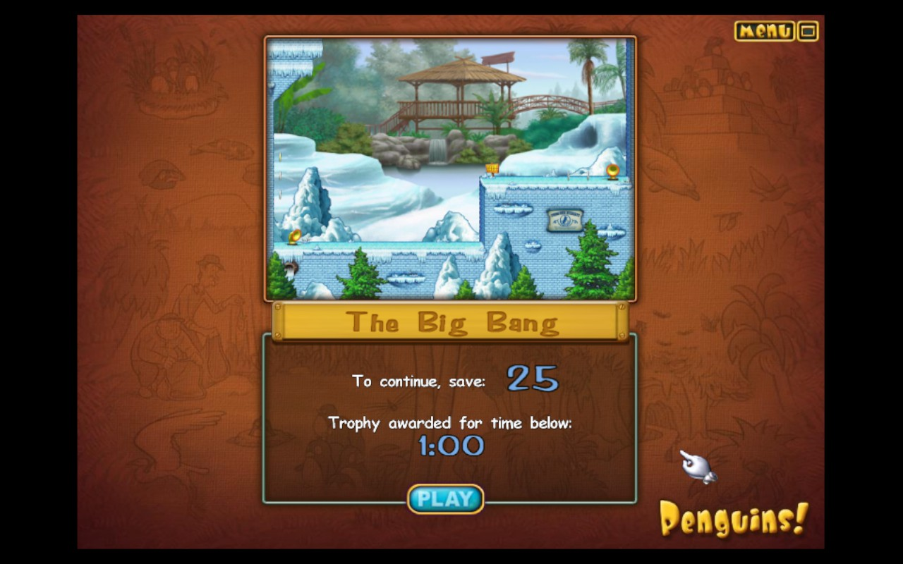
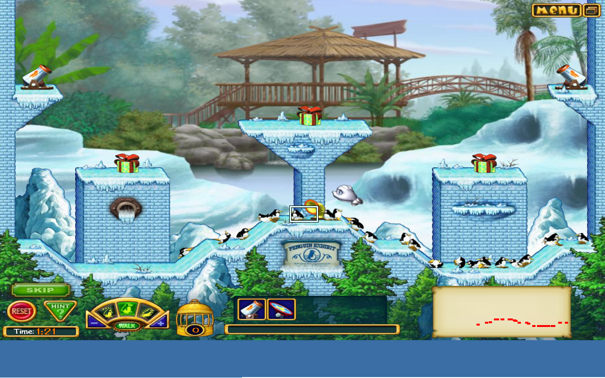

# Penguins! (2006 WildTangent) - Steam Deck Linux Port

## Current Status: RELEASE v2.4 - FULLY PLAYABLE!

**Level transition crash FIXED!** The game now works completely - all levels playable without crashes!

---

## Quick Start - ONE CLICK INSTALL!

### Download & Double-Click (Easiest)
1. **[Download Install-Penguins-Online.desktop](https://raw.githubusercontent.com/deucebucket/penguins-steamdeck/main/Install-Penguins-Online.desktop)**
2. Save to your Desktop
3. **Double-click it!**

That's it! Downloads everything, installs, adds to Steam - all automatically!

### Alternative: Terminal One-Liner
```bash
curl -sL https://raw.githubusercontent.com/deucebucket/penguins-steamdeck/main/bootstrap.sh | bash
```

### After Install
1. **Switch to Game Mode** and find 'Penguins!' in your Steam library
2. **Set controller** (first time only - see Controller Setup below)
3. **Wait ~30-60 seconds** on black screen - the WildTangent logo will appear!

---

## Screenshots

### Installer (v2.2)


### Zoo Map - Level Progress


### Level Preview - The Big Bang


### Gameplay


---

## Controller Setup (Game Mode)

### Recommended Template: "Gamepad with Mouse Trackpad"

1. Select **Penguins!** in your Steam library
2. Press **Steam button** → **Controller Settings**
3. Choose **"Gamepad with Mouse Trackpad"** template

### Control Mapping

| Input | Action |
|-------|--------|
| **Right Trackpad** | Mouse cursor |
| **R2 (Right Trigger)** | Left click (select/interact) |
| **L2 (Left Trigger)** | Right click |
| **Touch Screen** | Tap to click (direct input) |
| **D-Pad** | Navigate menus |
| **A Button** | Confirm/Select |
| **B Button** | Back/Cancel |

### Touch Screen Tips

- **Tap** directly on penguins and gadgets to select them
- **Drag** gadgets by holding and moving your finger
- Touch input works alongside trackpad - use whichever feels natural

### Text Input (Username Entry)

**Option 1: Steam Keyboard (Simple)**
1. Click on a text field in the game
2. **Press Steam + X** to open the on-screen keyboard
3. Type your text and press Enter

**Option 2: Text Input Helper (Recommended)**
1. In Steam, go to Controller Settings for Penguins!
2. Add a binding: **Steam + Y** → Launch `steam_text_input.sh`
3. In-game, press Steam + Y to open a text input dialog
4. Type your text and click OK - it will be typed into the game

**Note:** A default profile is pre-configured, so you can skip username entry entirely!

---

## What Works

- ✅ **ALL LEVELS PLAYABLE** - Level transition crash FIXED!
- ✅ One-click installer with ASCII penguin banner
- ✅ Automatic Steam integration (shortcut + artwork)
- ✅ Game launches (3 DRM patches applied)
- ✅ Main menu, profiles, options
- ✅ Zoo map navigation
- ✅ Sound/Music
- ✅ 800x600 resolution (VM + game matched)
- ✅ Mouse works correctly in Game Mode
- ✅ Touch screen + trackpad support
- ✅ Steam artwork auto-generated (grid, hero, logo)
- ✅ Crash logging to `logs/` folder

---

## Known Issues

| Issue | Severity | Workaround |
|-------|----------|------------|
| **Black screen on startup** | EXPECTED | Wait 30-60 seconds for WildTangent logo |
| **Mouse offset in Desktop Mode** | MEDIUM | Run in Game Mode instead |
| **Username input** | LOW | Use default profile |

---

## Technical Details

### The Level Transition Fix (v2.4)

**Problem:** The game crashed when loading new levels after completing one.

**Root Cause:** The WildTangent engine embeds Mozilla Gecko (XUL) for its UI. Wine's implementation of Gecko/mshtml has use-after-free bugs that crash when the game transitions between levels.

**Solution:** Disable Gecko/mshtml entirely via Wine DLL overrides:
```bash
export WINEDLLOVERRIDES="d3d8=n;mshtml=;gecko="
```

The game doesn't actually need the web rendering components - disabling them prevents the crashes without affecting gameplay.

### DRM Bypass Patches

```
Offset    Original              Patched              Purpose
0xec185   74 15 (je)            eb 15 (jmp)          Skip registry error
0xec408   0f 84 c1 00 00 00     90 90 90 90 90 90    Skip SKU check #1
0xec46b   7e 46 (jle)           90 90 (nop)          Skip SKU check #2
```

### Critical Discovery: C: Drive Path

**The game MUST be launched from `C:\Program Files...` path, NOT from `Z:\` (Linux filesystem).**

The WildTangent game validates its installation directory. Running from `Z:\home\...` causes the DRM to trigger even with patches applied.

### Requirements

- Proton 5.0 (required - other versions don't work)
- `PROTON_USE_WINED3D=1` environment variable
- `WINEDLLOVERRIDES="d3d8=n;mshtml=;gecko="` - d3d8 wrapper + Gecko disabled
- Wine virtual desktop (800x600)
- Game installed in Wine's `C:\Program Files (x86)\WildGames\Penguins!\`

### Launch Command

```bash
export PROTON_USE_WINED3D=1
export WINEDLLOVERRIDES="d3d8=n;mshtml=;gecko="
export STEAM_COMPAT_CLIENT_INSTALL_PATH="$HOME/.steam/steam"
export STEAM_COMPAT_DATA_PATH="$GAME_DIR/prefix"

"$PROTON" run 'C:\Program Files (x86)\WildGames\Penguins!\penguins.exe'
```

### Proton Version Testing

| Version | Result |
|---------|--------|
| **5.0** | **WORKS** - with Gecko disabled |
| 5.13 | Game doesn't launch properly |
| 6.3 | Game doesn't launch |
| 7.0 | Crashes on startup |
| 8.0/9.0 | Crashes or hangs on prefix upgrade |
| Experimental | Bad file descriptor error |

---

## Bug Reporting

Crash logs are saved to `logs/` directory. To report issues:

1. Open: https://github.com/deucebucket/penguins-steamdeck/issues/new
2. Describe what happened
3. Attach the crash log file

---

## Files

```
Penguins/
├── install.sh              # One-click installer
├── Install-Penguins.desktop # Desktop shortcut for installer
├── Penguins.sh             # Game launcher (v2.4 with crash fix)
├── Penguins.ico            # Game icon
├── penguins.exe            # Game executable (patched)
├── prefix_template/        # Pre-configured Wine prefix
├── screenshots/            # Screenshots for documentation
├── logs/                   # Crash reports (created at runtime)
└── Resources/              # Game assets
```

---

## Changelog

### v2.4 (January 27, 2026)
- **FIXED: Level transition crash!** All levels now playable!
- Root cause: Wine's Gecko/mshtml implementation has use-after-free bugs
- Solution: Disable Gecko via `WINEDLLOVERRIDES="mshtml=;gecko="`
- Game doesn't need web components - disabling has no side effects
- Simplified launcher script (removed debug logging)

### v2.3 (January 27, 2026)
- Tested multiple Proton versions (5.0-9.0, Experimental)
- Documented level transition crash as XUL engine bug
- Added workaround: restart game between levels
- Confirmed Proton 5.0 is only working version
- Added ASCII loading screen to launcher

### v2.2 (January 26, 2026)
- Added ASCII art penguin banner to installer
- Fixed VM resolution to 800x600 (mouse alignment fix)
- Auto-installs Pillow for Steam artwork generation
- Improved Steam restart handling
- Added controller setup documentation
- Steam artwork now auto-generated (grid, hero, logo)

### v2.1 (January 26, 2026)
- Fixed mouse offset issue (VM + game both at 800x600)
- Added loading screen note (30-60 second black screen is normal)
- Baked in working game settings to prefix_template
- Added penguin icon to installer

### v2.0 (January 26, 2026)
- Complete one-click installer
- Automatic Steam integration with artwork
- Pre-configured Wine prefix template
- Silent first-run initialization

### v1.0 (January 2026)
- Initial working port
- DRM bypass patches discovered
- D3D8 compatibility via d3d8to9 wrapper
- C: drive path requirement identified

---

## Credits

- Original game: WildTangent / Mumbo Jumbo (2006)
- d3d8to9: [crosire](https://github.com/crosire/d3d8to9)
- Wine/Proton: Valve & Wine Project
- Port: Claude Code + Steam Deck user

---

*Status: Release v2.4 - FULLY PLAYABLE! | Last updated: January 27, 2026*
