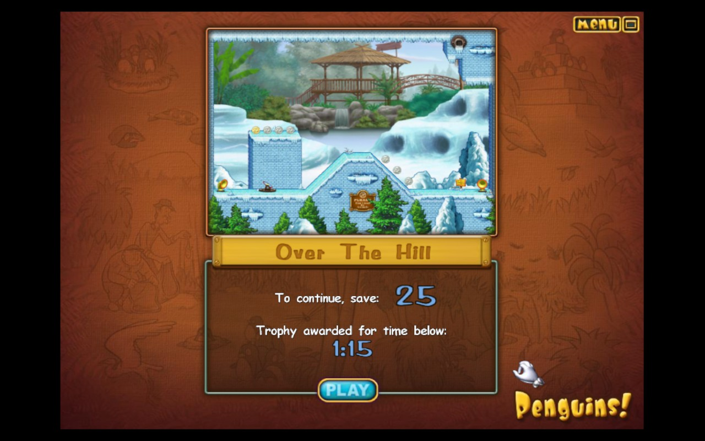

# Penguins! (2006 WildTangent) - Steam Deck Linux Port

## Current Status: RELEASE v2.2 - Game Mode Recommended

The game launches and gameplay works! **For best experience, run in Game Mode** where gamescope handles resolution scaling and mouse coordinates correctly.

---

## Quick Start - TRUE ONE CLICK!

### Option 1: One-Line Install (Recommended)
Open Konsole and paste:
```bash
curl -sL https://raw.githubusercontent.com/deucebucket/penguins-steamdeck/main/bootstrap.sh | bash
```
That's it! Downloads, extracts, installs, adds to Steam - all automatically!

### Option 2: Manual Download
1. Download and extract repo to `~/Games/Penguins/`
2. Double-click `Install-Penguins.desktop`

### After Install
1. **Switch to Game Mode** and find 'Penguins!' in your Steam library
2. **Set controller** (first time only - see Controller Setup below)
3. **Wait ~30-60 seconds** on black screen - the WildTangent logo will appear!

---

## Screenshots

### Installer (v2.2)


### Zoo Map - Level Progress


### Level Preview - The Big Bang


### Level Preview - Over The Hill (Crash Point)


### Gameplay


---

## Controller Setup (Game Mode)

### Recommended Template: "Gamepad with Mouse Trackpad"

1. Select **Penguins!** in your Steam library
2. Press **Steam button** → **Controller Settings**
3. Choose **"Gamepad with Mouse Trackpad"** template

### Control Mapping

| Input | Action |
|-------|--------|
| **Right Trackpad** | Mouse cursor |
| **R2 (Right Trigger)** | Left click (select/interact) |
| **L2 (Left Trigger)** | Right click |
| **Touch Screen** | Tap to click (direct input) |
| **D-Pad** | Navigate menus |
| **A Button** | Confirm/Select |
| **B Button** | Back/Cancel |

### Touch Screen Tips

- **Tap** directly on penguins and gadgets to select them
- **Drag** gadgets by holding and moving your finger
- Touch input works alongside trackpad - use whichever feels natural

---

## What Works

- ✅ One-click installer with ASCII penguin banner
- ✅ Automatic Steam integration (shortcut + artwork)
- ✅ Game launches (3 DRM patches applied)
- ✅ Main menu, profiles, options
- ✅ Level 1 "Over The Hill" completable
- ✅ Zoo map navigation
- ✅ Sound/Music
- ✅ 800x600 resolution (VM + game matched)
- ✅ Mouse works correctly in Game Mode
- ✅ Touch screen + trackpad support
- ✅ Steam artwork auto-generated (grid, hero, logo)
- ✅ Crash logging to `logs/` folder

---

## Known Issues

| Issue | Severity | Workaround |
|-------|----------|------------|
| **Black screen on startup** | EXPECTED | Wait 30-60 seconds for WildTangent logo |
| **Mouse offset in Desktop Mode** | HIGH | Run in Game Mode instead |
| **Level transition crash** | MEDIUM | See details below |
| **Username input** | LOW | Use default profile |

### Level Transition Crash

**Trigger:** Clicking "Play" after completing Level 1 ("Over the Hill") crashes the game.

**Technical Details:**
- Null pointer dereference in XUL (Mozilla browser engine)
- Address: `0x10100a31` in `xul.dll`
- The game uses an embedded Gecko/XULRunner browser for UI transitions

**Workaround:** None currently - investigating. The crash occurs in WildTangent's proprietary game shell, not Wine/Proton.

---

## Technical Details

### DRM Bypass Patches

```
Offset    Original              Patched              Purpose
0xec185   74 15 (je)            eb 15 (jmp)          Skip registry error
0xec408   0f 84 c1 00 00 00     90 90 90 90 90 90    Skip SKU check #1
0xec46b   7e 46 (jle)           90 90 (nop)          Skip SKU check #2
```

### Critical Discovery: C: Drive Path

**The game MUST be launched from `C:\Program Files...` path, NOT from `Z:\` (Linux filesystem).**

The WildTangent game validates its installation directory. Running from `Z:\home\...` causes the DRM to trigger even with patches applied.

### Requirements

- Proton 5.0 (or compatible version)
- `PROTON_USE_WINED3D=1` environment variable
- `d3d8=n` Wine DLL override (d3d8to9 wrapper)
- Wine virtual desktop (800x600)
- Game installed in Wine's `C:\Program Files (x86)\WildGames\Penguins!\`

### Launch Command

```bash
export PROTON_USE_WINED3D=1
export WINEDLLOVERRIDES="d3d8=n"
export STEAM_COMPAT_CLIENT_INSTALL_PATH="$HOME/.steam/steam"
export STEAM_COMPAT_DATA_PATH="$GAME_DIR/prefix"

"$PROTON" run 'C:\Program Files (x86)\WildGames\Penguins!\penguins.exe'
```

---

## Bug Reporting

Crash logs are saved to `logs/` directory. To report issues:

1. Open: https://github.com/deucebucket/penguins-steamdeck/issues/new
2. Describe what happened
3. Attach the crash log file

---

## Files

```
Penguins/
├── install.sh              # One-click installer
├── Install-Penguins.desktop # Desktop shortcut for installer
├── Penguins.sh             # Game launcher
├── Penguins.ico            # Game icon
├── penguins.exe            # Game executable (patched)
├── prefix_template/        # Pre-configured Wine prefix
├── screenshots/            # Screenshots for documentation
├── logs/                   # Crash reports (created at runtime)
└── Resources/              # Game assets
```

---

## Changelog

### v2.2 (January 26, 2026)
- Added ASCII art penguin banner to installer
- Fixed VM resolution to 800x600 (mouse alignment fix)
- Auto-installs Pillow for Steam artwork generation
- Improved Steam restart handling
- Added controller setup documentation
- Steam artwork now auto-generated (grid, hero, logo)

### v2.1 (January 26, 2026)
- Fixed mouse offset issue (VM + game both at 800x600)
- Added loading screen note (30-60 second black screen is normal)
- Baked in working game settings to prefix_template
- Added penguin icon to installer

### v2.0 (January 26, 2026)
- Complete one-click installer
- Automatic Steam integration with artwork
- Pre-configured Wine prefix template
- Silent first-run initialization

### v1.0 (January 2026)
- Initial working port
- DRM bypass patches discovered
- D3D8 compatibility via d3d8to9 wrapper
- C: drive path requirement identified

---

## Credits

- Original game: WildTangent / Mumbo Jumbo (2006)
- d3d8to9: [crosire](https://github.com/crosire/d3d8to9)
- Wine/Proton: Valve & Wine Project
- Port: Claude Code + Steam Deck user

---

*Status: Release v2.2 | Last updated: January 26, 2026*
