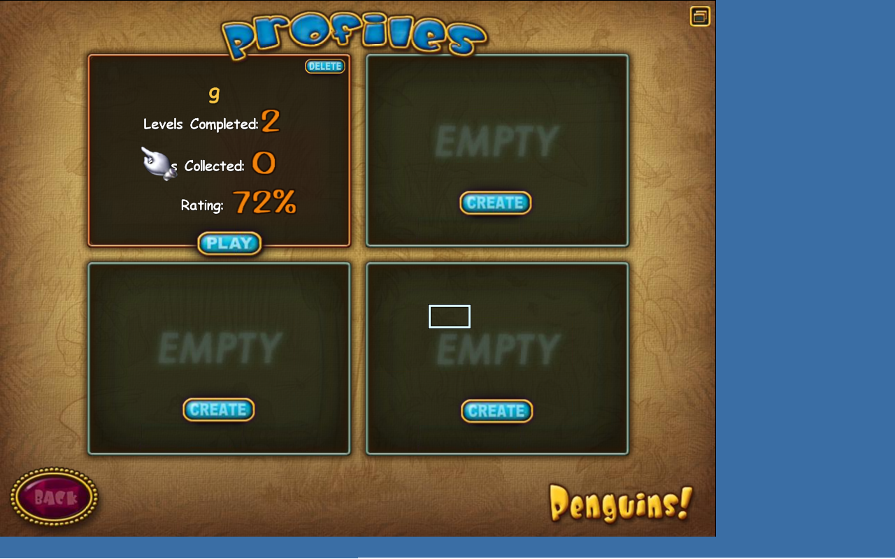
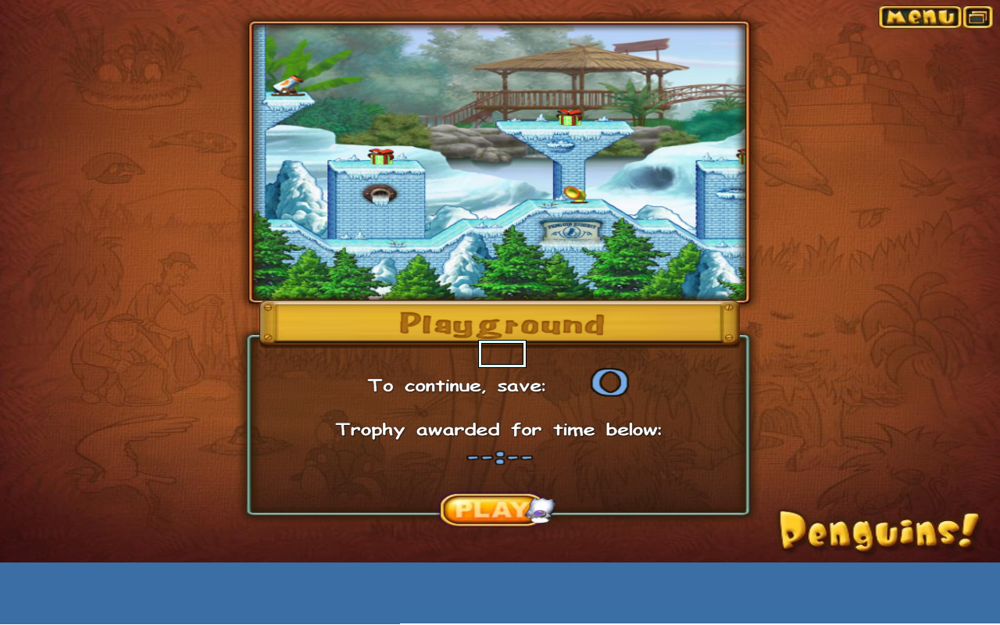
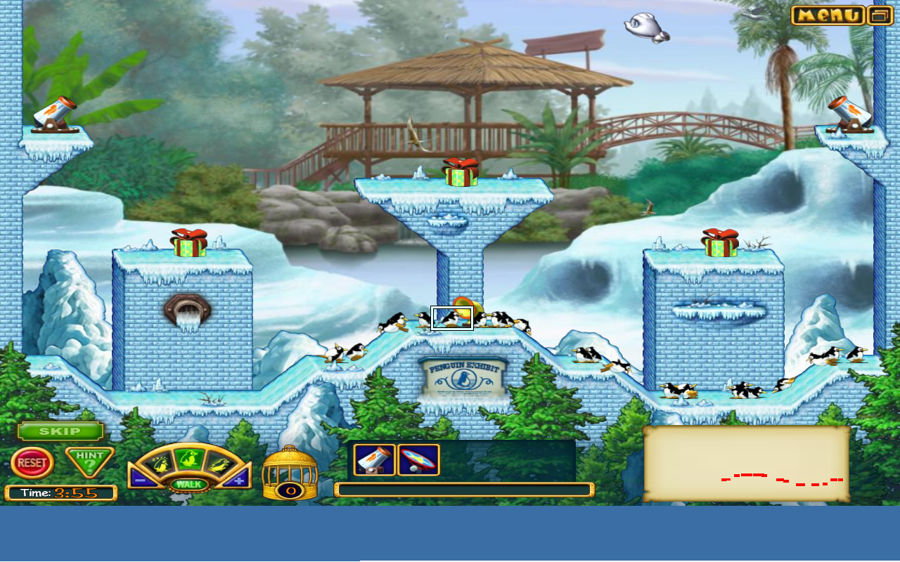

# Penguins! (2006 WildTangent) - Steam Deck Linux Port

## 🚧 WORK IN PROGRESS - NOT READY FOR GENERAL USE 🚧

This is an experimental port of the 2006 WildTangent game "Penguins!" to Linux/Steam Deck. **This is NOT a one-click installer yet!**

### Current Status: ALPHA

The game launches and gameplay works, but there are significant issues that need fixing before this is ready for general use.

---

## 🏆 Possibly the First Working Linux Port

No documented successful runs found on WineHQ AppDB, ProtonDB, or Linux forums. We may be the first to get this game partially working on Linux!

---

## 📸 Screenshots

### Main Menu


### Profiles Screen


### Options Menu (1280x720 Native Support!)


### Level Selection


### Gameplay (8+ Minutes Stable!)


### More Gameplay


<details>
<summary>📁 View all 24 screenshots</summary>

| Screenshot | Description |
|------------|-------------|
| [01_main_menu.png](screenshots/01_main_menu.png) | Loading screen |
| [02_main_menu_loaded.png](screenshots/02_main_menu_loaded.png) | Main menu |
| [03_after_play_click.png](screenshots/03_after_play_click.png) | After clicking play |
| [04_play_attempt2.png](screenshots/04_play_attempt2.png) | Play attempt |
| [05_after_profile_play.png](screenshots/05_after_profile_play.png) | Profile screen |
| [06_play_click.png](screenshots/06_play_click.png) | Play click |
| [07_absolute_click.png](screenshots/07_absolute_click.png) | Profiles |
| [08_play_precise.png](screenshots/08_play_precise.png) | Options menu |
| [09_back_to_game.png](screenshots/09_back_to_game.png) | Level select |
| [10_gameplay.png](screenshots/10_gameplay.png) | Gameplay start |
| [11_gameplay_focused.png](screenshots/11_gameplay_focused.png) | Gameplay |
| [12_skip_clicked.png](screenshots/12_skip_clicked.png) | Skip button |
| [13_menu.png](screenshots/13_menu.png) | In-game |
| [14_progress.png](screenshots/14_progress.png) | Game progress |
| [15_tool_use.png](screenshots/15_tool_use.png) | Using tools |
| [16_level_end.png](screenshots/16_level_end.png) | Level end |
| [17_hint.png](screenshots/17_hint.png) | Hint system |
| [18_tool_placed.png](screenshots/18_tool_placed.png) | Tool placed |
| [19_monitor_1-5.png](screenshots/19_monitor_1.png) | Monitoring gameplay |
| [20_reset.png](screenshots/20_reset.png) | Reset |

</details>

---

## ✅ What Works

- ✅ Game launches (DRM bypassed)
- ✅ Main menu loads
- ✅ Profile system
- ✅ Options menu
- ✅ Level selection
- ✅ In-game gameplay (penguins move, timer works)
- ✅ Sound/Music
- ✅ 8+ minutes stable gameplay tested

---

## ❌ What DOESN'T Work Yet

| Issue | Severity | Description |
|-------|----------|-------------|
| **Mouse offset** | 🔴 HIGH | In 720p mode, clicks don't align with where you click. Game area offset from mouse coordinates. |
| **Level completion crash** | 🔴 HIGH | Clicking "Next" after completing a level may crash the game. Needs investigation. |
| **Username input** | 🟡 MEDIUM | Cannot type username when creating profile. Steam keyboard doesn't work. Need config file workaround. |
| **Touch screen** | 🟡 MEDIUM | Touch coordinates offset, similar to mouse issue. |
| **Virtual desktop required** | 🟡 MEDIUM | Game runs in Wine virtual desktop window, not fullscreen. |

---

## 🔧 Technical Details

### Binary Patches (DRM Bypass)

```
Offset    Original           Patched              Purpose
0xec185   74 15 (je)         eb 15 (jmp)          Skip registry error
0xec408   0f 84 c1 00 00 00  90 90 90 90 90 90    Skip SKU check #1
0xec46b   7e 46 (jle)        90 90 (nop)          Skip SKU check #2
```

### Requirements
- Proton 5.0 with `PROTON_USE_WINED3D=1`
- d3d8to9 wrapper (or native d3d8 override)
- Wine virtual desktop mode (1280x720)

### Launch Command

```bash
PROTON_USE_WINED3D=1 \
WINEDLLOVERRIDES="d3d8=n" \
STEAM_COMPAT_CLIENT_INSTALL_PATH="/home/deck/.steam/steam" \
STEAM_COMPAT_DATA_PATH="$PREFIX_PATH" \
"/path/to/Proton 5.0/proton" run penguins.exe
```

---

## 🎯 TODO

- [ ] Fix mouse/touch offset - Critical for playability
- [ ] Fix level completion crash
- [ ] Add username config workaround
- [ ] Test fullscreen mode
- [ ] Create one-click installer
- [ ] Test in Game Mode

---

## 📁 Repo Contents

- `penguins.exe` - Patched game executable
- `Penguins.sh` - Launcher script
- `Resources/` - Game assets
- `screenshots/` - 24 proof screenshots
- `WildTangent.reg` - Registry entries
- `CHANGELOG.md` - Version history

---

## 🙏 Credits

- Original game: WildTangent / Mumbo Jumbo (2006)
- d3d8to9: [crosire](https://github.com/crosire/d3d8to9)
- Wine/Proton: Valve & Wine Project
- Port: Claude Code + Steam Deck user

---

*Status: Alpha | Last updated: January 23, 2026*
