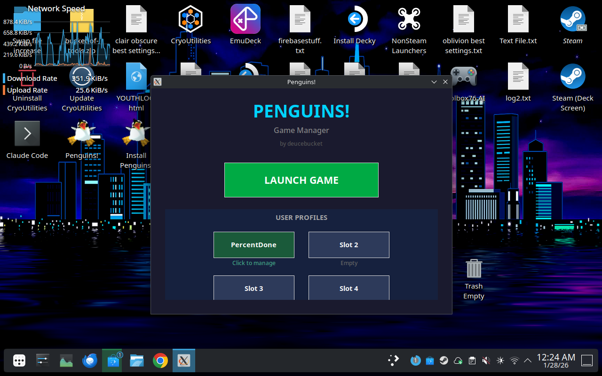

# Penguins! (2006 WildTangent) - Steam Deck Linux Port

## FULLY PLAYABLE - v2.6

The classic WildTangent puzzle game, now working on Steam Deck/Linux!

---

## Quick Start

### One-Click Install
```bash
curl -sL https://raw.githubusercontent.com/deucebucket/penguins-steamdeck/main/bootstrap.sh | bash
```

Or download [Install-Penguins-Online.desktop](https://raw.githubusercontent.com/deucebucket/penguins-steamdeck/main/Install-Penguins-Online.desktop) and double-click it.

### After Install
1. Run the **Penguins! Manager** from your desktop
2. **Create a profile** (click an empty slot, enter your name)
3. Click **Launch Game**
4. Wait ~30 seconds for the WildTangent logo to appear

---

## Game Manager

The manager handles everything - profiles, updates, and launching the game.



### Features
- **Launch Game** - Starts Penguins!
- **Create Profiles** - Click any empty slot, enter a username, profile is created instantly
- **Manage Profiles** - Click an existing profile to:
  - **Rename** - Change your username
  - **Copy** - Duplicate to another slot
  - **Reset** - Fresh start (keeps username)
  - **Delete** - Remove the profile
- **Check Updates** - Download latest fixes from GitHub
- **Repair Install** - Reset game files if something breaks

**You must create at least one profile before playing!**

---

## Controller Setup (Game Mode)

Use the **"Gamepad with Mouse Trackpad"** template in Steam:

| Input | Action |
|-------|--------|
| Right Trackpad | Mouse cursor |
| R2 | Left click |
| L2 | Right click |
| Touch Screen | Tap to click |
| A | Confirm |
| B | Back |

---

## What Works

- All levels playable (level transition crash fixed!)
- Profile system with up to 4 save slots
- Full mouse/trackpad/touchscreen support
- Sound and music
- Steam integration with artwork

---

## Technical Details

### The Critical Fixes

**Level Transition Crash (v2.4)**
The WildTangent engine embeds Mozilla Gecko for UI rendering. Wine's implementation has use-after-free bugs that crash between levels. Fixed by disabling Gecko:
```bash
export WINEDLLOVERRIDES="d3d8=n;mshtml=;gecko="
```

**DRM Bypass**
Three binary patches skip the WildTangent registration checks:
```
0xec185: je → jmp    (skip registry error)
0xec408: jz → NOP    (skip SKU check 1)
0xec46b: jle → NOP   (skip SKU check 2)
```

**C: Drive Requirement**
The game must launch from `C:\Program Files...` not `Z:\` (Linux path). The DRM validates the install directory.

### Requirements
- Proton 5.0 (only version that works)
- Steam Deck or Linux with Steam

---

## Files

```
Penguins/
├── PenguinsManager.py    # Game manager (run this!)
├── PenguinsManager.sh    # Shell wrapper for manager
├── Penguins.sh           # Game launcher
├── install.sh            # Installer script
├── prefix/               # Wine prefix with game
└── screenshots/          # Documentation images
```

---

## Troubleshooting

| Problem | Solution |
|---------|----------|
| Black screen on launch | Normal - wait 30-60 seconds |
| "No profile" warning | Create a profile in the manager first |
| Mouse offset | Run in Game Mode, not Desktop Mode |
| Game won't start | Run Repair in the manager |

---

## Credits

- Original game: WildTangent / Mumbo Jumbo (2006)
- Port: deucebucket + Claude Code
- Wine/Proton: Valve & Wine Project

---

## Development History

This port required significant reverse engineering:
- v0.1: First launch after DRM bypass discovery
- v0.2: Gameplay verified, mouse issues identified
- v2.0-2.2: One-click installer, Steam integration
- v2.4: Level transition crash fixed (Gecko disabled)
- v2.5: Game manager added
- v2.6: Complete manager rewrite with instant profile creation

See [CHANGELOG.md](CHANGELOG.md) for full details.

---

*v2.6 - January 28, 2026*
