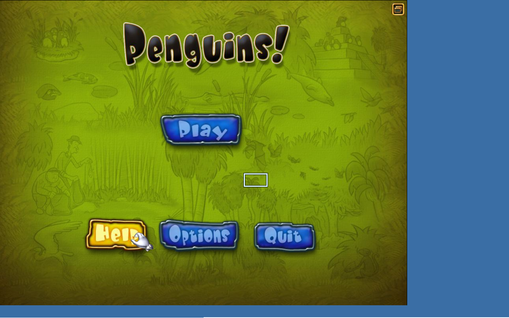
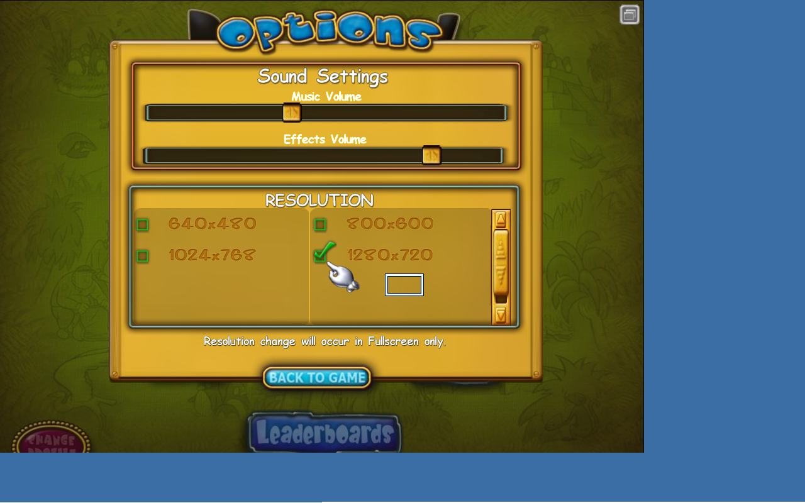

# Penguins! (2006 WildTangent) - Steam Deck Linux Port

## Current Status: BETA - Game Mode Recommended

The game launches and gameplay works! **For best experience, run in Game Mode** where gamescope handles resolution scaling and mouse coordinates correctly.

---

## Quick Start

1. **Install Proton 5.0** from Steam (required)
2. **Add to Steam** as a non-Steam game (point to `Penguins.sh`)
3. **Switch to Game Mode** and play!

---

## Screenshots

### Main Menu


### Options (1280x720 Supported!)


### Gameplay (8+ Minutes Stable!)


---

## What Works

- Game launches (DRM bypassed)
- Main menu, profiles, options
- Level selection and gameplay
- Sound/Music
- 1280x720 resolution in Game Mode
- 8+ minutes stable gameplay tested

---

## Known Issues

| Issue | Severity | Workaround |
|-------|----------|------------|
| **Mouse offset in Desktop Mode** | HIGH | Run in Game Mode instead |
| **Level completion crash** | MEDIUM | Save progress frequently |
| **Username input** | LOW | Use default profile |

---

## Technical Details

### DRM Bypass Patches

```
Offset    Original              Patched              Purpose
0xec185   74 15 (je)            eb 15 (jmp)          Skip registry error
0xec408   0f 84 c1 00 00 00     90 90 90 90 90 90    Skip SKU check #1
0xec46b   7e 46 (jle)           90 90 (nop)          Skip SKU check #2
```

### Critical Discovery: C: Drive Path

**The game MUST be launched from `C:\Program Files...` path, NOT from `Z:\` (Linux filesystem).**

The WildTangent game validates its installation directory. Running from `Z:\home\...` causes the DRM to trigger even with patches applied.

### Requirements

- Proton 5.0 (or compatible version)
- `PROTON_USE_WINED3D=1` environment variable
- `d3d8=n` Wine DLL override (d3d8to9 wrapper)
- Wine virtual desktop (1280x720)
- Game installed in Wine's `C:\Program Files (x86)\WildGames\Penguins!\`

### Launch Command

```bash
export PROTON_USE_WINED3D=1
export WINEDLLOVERRIDES="d3d8=n"
export STEAM_COMPAT_CLIENT_INSTALL_PATH="$HOME/.steam/steam"
export STEAM_COMPAT_DATA_PATH="$GAME_DIR/prefix"

"$PROTON" run 'C:\Program Files (x86)\WildGames\Penguins!\penguins.exe'
```

---

## Bug Reporting

Crash logs are saved to `logs/` directory. To report issues:

1. Open: https://github.com/deucebucket/penguins-steamdeck/issues/new
2. Describe what happened
3. Attach the crash log file

---

## Files

- `Penguins.sh` - Launcher script with crash logging
- `prefix/` - Wine/Proton prefix with game installed
- `logs/` - Crash reports
- `screenshots/` - Proof of working gameplay

---

## Credits

- Original game: WildTangent / Mumbo Jumbo (2006)
- d3d8to9: [crosire](https://github.com/crosire/d3d8to9)
- Wine/Proton: Valve & Wine Project
- Port: Claude Code + Steam Deck user

---

*Status: Beta | Last updated: January 26, 2026*
